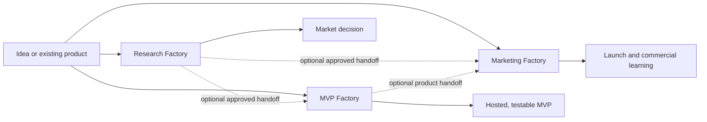

# App Factory Skills

Independent Codex skills for three opt-in workflows: building a hosted MVP, researching/validating a market, and launching/learning commercially.

The factories keep every stage explicit. Each skill consumes durable artifacts, reports missing context instead of silently inventing consequential requirements, and never invokes another factory automatically.

## Factory selection

| Objective | Factory | Entry skill |
| --- | --- | --- |
| Define, build, and host a product | MVP | `product-brief-architect` |
| Research and challenge a market hypothesis | Research | `market-research-architect` |
| Plan, create, execute, and evaluate a launch | Marketing | `commercial-launch-architect` |



Research and marketing are optional. The MVP Factory does not depend on either of them.

## MVP Factory flow

```txt
Idea, PRD, or client notes
  -> product-brief-architect
  -> @sites + app-factory-frontend-builder
  -> django-backend-service-architect
  -> app-factory-backend-router
  -> OpenCode Go or Codex + django-backend-code-executor
  -> django-backend-service-architect audit
  -> app-factory-infra-orchestrator
  -> publication and MVP validation
```

| Stage | Input | Skill | Output |
| --- | --- | --- | --- |
| Product | Idea, PRD, notes, screens | `product-brief-architect` | Executable PRD and implementation contracts |
| Frontend | Product contracts | external `@sites` + `app-factory-frontend-builder` | Visible preview, React frontend, private Sites URL, mocks/adapters, tests, API handoff |
| Backend design | Product and frontend contracts | `django-backend-service-architect` | Approved backend contracts, project context, and local architecture skill kit |
| Backend routing | Approved backend contracts | `app-factory-backend-router` | OpenCode delegation or automatic Codex fallback |
| Backend implementation | Approved backend contracts | OpenCode Go or Codex using `django-backend-code-executor` | Django code, generated migrations, tests, and validation evidence |
| Backend audit | Contracts and implementation evidence | `django-backend-service-architect` | Approval or bounded correction findings |
| Infrastructure | Frontend/backend shape | `app-factory-infra-orchestrator` | Docker, environments, deployment contracts and validation |

## Research Factory flow

```txt
Market question
  -> market-research-architect
  -> app-factory-research-router
  -> Codex / AppStoreTracker + Apple / OpenAlex / optional Perplexity / read-only Manus
  -> market-validation-harness
  -> proceed | experiment | revise | pause | reject
```

AppStoreTracker is the primary quantitative intelligence source for a specific iOS app, developer/app family, or comparable cohort. Revenue/download figures remain directional estimates. Manus is reserved for read-only native-platform research, such as finding relevant influencers more efficiently.

## Marketing Factory flow

```txt
Product or launch input
  -> commercial-launch-architect
  -> marketing-creative-builder
  -> app-factory-commercial-router
  -> Codex / human gate / manus-commercial-operator
  -> commercial-validation-analyst
  -> scale | iterate | pivot | pause | stop
```

Codex produces strategy, account setup information, copy, creative assets, and analysis. The human creates and secures accounts. Manus performs only exact approved platform actions or measurement and returns a receipt.

See `docs/codex-manus-integration.md` for the API v2 coupling, portable Manus skills, connector authorization, structured receipts, confirmation gates, and credit controls.

## Product contract

Small products may use one file:

```txt
docs/product/product-brief.md
```

Platforms and products with multiple modules use:

```txt
docs/product/
  prd.md
  screen-map.md
  business-rules.md
  data-contract.md
  visual-direction.md
  acceptance-criteria.md
```

An existing PRD remains the source of truth. The product skill creates only the missing companion contracts.

## Install

```powershell
$codexHome = if ($env:CODEX_HOME) { $env:CODEX_HOME } else { Join-Path $env:USERPROFILE ".codex" }
$skillsHome = Join-Path $codexHome "skills"

Get-ChildItem .\skills -Directory | ForEach-Object {
  Copy-Item -Recurse $_.FullName (Join-Path $skillsHome $_.Name) -Force
}
```

Install only the product skill:

```powershell
$codexHome = if ($env:CODEX_HOME) { $env:CODEX_HOME } else { Join-Path $env:USERPROFILE ".codex" }
$skillName = "product-brief-architect"
Copy-Item -Recurse (Join-Path ".\skills" $skillName) (Join-Path $codexHome "skills\$skillName") -Force
```

## Usage

```txt
Use $product-brief-architect to transform these notes into an executable product contract.

Use @sites to build, show, and privately publish this product. Follow $app-factory-frontend-builder as the mandatory implementation contract and read docs/product/.

Use $django-backend-service-architect to create the backend planning specs from the product and frontend contracts.

Use $app-factory-backend-router to route the explicitly approved backend implementation contract to OpenCode Go with Codex fallback.

Use $django-backend-code-executor directly when Codex is selected or the router requests fallback.

Use $app-factory-infra-orchestrator to prepare local and deployment infrastructure.

Use $market-research-architect to create an executable research contract for this app idea.

Use $app-market-intelligence-analyst to analyze this iOS app, its developer family, and a comparable cohort with AppStoreTracker and Apple evidence.

Use $market-validation-harness to challenge this evidence bundle and recommend the cheapest next experiment.

Use $commercial-launch-architect to create the launch contract and Instagram account setup kit for this app.

Use $marketing-creative-builder to create the approved launch creative pack without publishing it.

Use $app-factory-commercial-router to route this exact approved publish operation while minimizing Manus usage.
```

## Skills

| Skill | Responsibility |
| --- | --- |
| `product-brief-architect` | Product scope, screens, rules, data, visual direction, acceptance criteria |
| `app-factory-frontend-builder` | Direct React implementation using the factory stack and feature architecture |
| `django-backend-service-architect` | Backend planning, project context, local architecture kit, contract approval, and implementation audit |
| `app-factory-backend-router` | Optional OpenCode Go routing, passive wait, structured wake-up, and Codex fallback |
| `django-backend-code-executor` | Approved Django implementation using scalable domain packages, explicit Mappers, DTO, Controller, Service, Repository, Configuration, and Model boundaries |
| `app-factory-infra-orchestrator` | Docker, environment, Supabase, Vercel, container and VPS paths |

### Research Factory

| Skill | Responsibility |
| --- | --- |
| `market-research-architect` | Research decision, hypotheses, falsifiers, evidence tasks, depth and completion rules |
| `app-factory-research-router` | Provider/source routing, cost controls, fallbacks and evidence lineage |
| `app-market-intelligence-analyst` | AppStoreTracker/Apple analysis of iOS apps, developers/families and cohorts |
| `manus-platform-researcher` | Read-only discovery inside native/authenticated platforms |
| `market-validation-harness` | Adversarial evidence audit, decision and next experiment |

### Marketing Factory

| Skill | Responsibility |
| --- | --- |
| `commercial-launch-architect` | Positioning, offer, channels, account setup kits, campaign, KPIs and experiments |
| `marketing-creative-builder` | Channel-ready copy/assets, variants, accessibility, UTM and manifest |
| `app-factory-commercial-router` | Codex/Manus/human routing, confirmation gates and credit control |
| `manus-commercial-operator` | Bounded approved native execution and verification receipt |
| `commercial-validation-analyst` | Funnel/data-quality analysis and scale/iterate/pivot/pause/stop decision |

## Frontend baseline

- Node.js 24 LTS and npm
- React 19, TypeScript strict, Vite, React Router
- PrimeReact, PrimeIcons and SCSS Modules
- React Hook Form, Zod, TanStack Query and Axios
- Vitest, Testing Library, Playwright, ESLint and Prettier
- feature architecture with `Route -> Feature Page -> Hook/View Model -> Service -> Repository Adapter`
- exact direct dependency versions and committed npm lockfile
- dependency scripts disabled by default, seven-day minimum package age, and registry/source restrictions

Sites remains an external Codex plugin. It owns preview and publication when explicitly referenced in the creation command; it is not installed in the React dependency graph.

## Safety gates

- Product decisions involving permissions, compliance, billing, sensitive data, or core scope are never guessed silently.
- Frontend components cannot access API, mocks, storage, or environment variables directly.
- Backend planning specs, decision summary, project-local architecture skill kit, and explicit contract approval precede Django implementation.
- Backend execution uses OpenCode only when its CLI, OpenCode Go credential, and configured model are ready; otherwise Codex continues automatically.
- Domain apps use one Model/Configuration module per entity, DTO/Mapper/Controller modules per use case, repository-only ORM access, persistence-agnostic Services, opening module docstrings in every authored Python file, and Django-generated migrations.
- Infrastructure never commits secrets or claims readiness without attempted validation.

## Repository layout

```txt
app-factory-skills/
  skills/
    # MVP Factory
    product-brief-architect/
    app-factory-frontend-builder/
    django-backend-service-architect/
    app-factory-backend-router/
    django-backend-code-executor/
    app-factory-infra-orchestrator/
    # Research Factory
    market-research-architect/
    app-factory-research-router/
    app-market-intelligence-analyst/
    manus-platform-researcher/
    market-validation-harness/
    # Marketing Factory
    commercial-launch-architect/
    marketing-creative-builder/
    app-factory-commercial-router/
    manus-commercial-operator/
    commercial-validation-analyst/
  .codex/
  docs/
  specs/
  templates/
  examples/
```

`skills/` contains installable factory skills. `.codex/` contains factory-level workflows, references, checklists, goals, and templates. Generated projects receive their own `.codex/` context and a compact `.agents/skills/` backend architecture kit, then may add contract-backed product-specific domain skills.

The generated backend kit includes `django-model-configuration`, `django-dto-mapper`, `django-repository`, `django-service`, `django-controller`, `django-migration`, `django-backend-testing`, and `backend-domain-skill-author`.

## Optional OpenCode backend executor

OpenCode is an optional low-cost writer for approved backend work. Install and configure it using [docs/opencode-backend-execution.md](docs/opencode-backend-execution.md). The API key is stored by OpenCode outside this repository; `.env` contains only non-secret routing preferences.

```powershell
Copy-Item .env.example .env
node .\skills\app-factory-backend-router\scripts\opencode-doctor.mjs
$projectRoot = (Resolve-Path ..\my-project).Path
node .\skills\app-factory-backend-router\scripts\route-backend-execution.mjs --project-root $projectRoot
```

## Validation

```powershell
$codexHome = if ($env:CODEX_HOME) { $env:CODEX_HOME } else { Join-Path $env:USERPROFILE ".codex" }
$quickValidate = Join-Path $codexHome "skills\.system\skill-creator\scripts\quick_validate.py"
Get-ChildItem .\skills -Directory | ForEach-Object {
  python $quickValidate $_.FullName
}

node .\skills\app-factory-research-router\scripts\test-router.mjs
node .\skills\app-factory-commercial-router\scripts\test-router.mjs
node .\skills\app-factory-backend-router\scripts\opencode-doctor.mjs
node .\skills\product-brief-architect\scripts\validate-product-contract.mjs <project-root>
node .\skills\app-factory-frontend-builder\scripts\scan-app-factory-frontend.mjs <project-root>
python .\skills\django-backend-service-architect\scripts\scan-django-architecture.py
python .\skills\django-backend-code-executor\scripts\scan-django-boundaries.py
node .\skills\app-factory-infra-orchestrator\scripts\scan-infra.mjs
```
